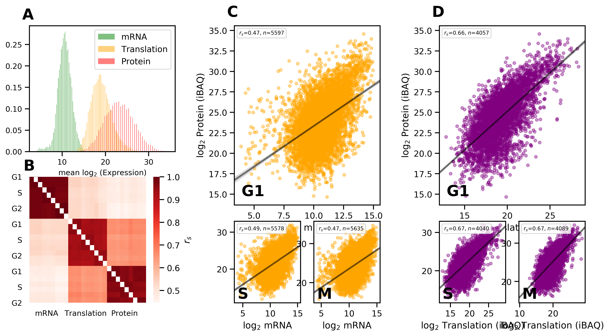

# `sdfmodel`: Modelling protein abundance via sequence information

This account follows the PhD thesis and works
of Gregory Parkes, PhD candidate. This class will provide
users with an interface to train models on protein abundance
or function values using sequence-derived features (SDFs), which are
also provided. Some of this
work is published in [BMC Bioinformatics](https://pubmed.ncbi.nlm.nih.gov/31664894/) 
for applicational example.

The breakdown of features we have derived is as follows:


A majority of features are derived from mRNA transcripts taken
from NCBI; of which a majority of mono and dinucleotide counts. 
There are also amino-acid derived features, biophysical properties
and external data measuring post-translational modification sites.

## Use case - PAXDB

In this repository we provide a pre-trained model that is fitted on steady-state protein
abundances for over 15000 *H. sapiens* proteins as provided by PAXDB. See the figure below for
a comparison of predicted versus measured protein levels:


With no reference to mRNA abundance or other corresponding measured data, sequence-based
information alone can account for a significant portion of protein variance (r-squared = 0.56).
Many studies have looked at mRNA-protein relationships across many different organisms, each reporting
widely ranged correlation values that are generally higher for lower-order organisms.

It is worth pointing out several things here; firstly the predicted/actual relationship largely
resembles mRNA/protein scatterplots, and secondly that the distribution of residuals doesn't have
constant variance, leading to some aberrant behaviour particularly at the low protein level end. Thirdly,
the model does particularly well for highly expressed proteins (>25).

## How to use

We recommend you open up the Jupyter notebooks and follow
the two examples provided. However for brief illustration we will highlight the
basic usage as follows:

```python
>>> from sdfmodel import SDFModel

>>> with SDFModel() as model:
>>>     pred = model.predict(['HIST4H4'])
>>> pred
HIST4H4    28.984224
dtype: float32
```

`predict()` can also accept labels that follow REGular EXpression patterns, in this case
we can find all ribosomal 27 proteins located in HGNC symbols:

```python
>>> from sdfmodel import SDFModel

>>> with SDFModel() as model:
>>>     pred2 = model.predict("^RPS27")
>>> pred2
RPS27A    28.185459
RPS27     26.031109
dtype: float32
```

Protein abundances are given as log-2 normalized, so users can compute `pow(2, x)` and divide by 1 million
to get parts-per-million (PPM).

## Requirements

This project is written in [Python](https://www.python.org/). We recommend you install the appropriate
[Anaconda distribution](https://www.anaconda.org) for your operating system. 
Then install the following packages:

- `numpy`>=1.0
- `scipy`>=1.0
- `pandas`>=1.0
- `matplotlib`
- `scikit-learn`>=0.24
- `xgboost`
- `tqdm`
- `jupyter`
- `xlrd`>=1.1.0

Note that requirements are provided in the `environment.yml` file.

## Cloning the Repository and Set-up

Firstly, ensure that [Anaconda](https://www.anaconda.org) is installed if not already.

Clone this repository manually on the Github page by clicking **Code** then hit
**Download ZIP**. Alternatively for Mac/Linux users
open up **Terminal**, move to an appropriate directory with `ls` and `cd` then type:

```bash
git clone https://github.com/gregparkes/sdfmodel.git
```

here we assume users have [Git](https://git-scm.com/downloads) 
installed on their computer. Mac/Linux users can install Git via [Homebrew](https://brew.sh/).

### Creating the environment

We provide an `environment.yml` file for you in the directory, which is read by conda to download
and install all relevant dependencies.
If you use a Git package manager such as Github Desktop or Gitkraken, then use the methods provided by
them. 

#### Mac/Linux

For Mac and Linux users once the package is cloned, open **Terminal**
and type:

```bash
conda env create -f environment.yml
conda activate sdfmodel
jupyter notebook
```

We recommend you work in [Jupyter notebook](https://jupyter.org/) for this project. Note that sometimes 
`conda activate sdfmodel` could be replaced with `source activate sdfmodel`.

#### Windows

For Windows users, open **Anaconda Navigator**, click on **Environments** on 
the left-hand side, then click **Import**, navigate to where this repository is saved and click the
`environment.yml` file. This may take some time, and another popup may appear, where you simply click **Apply**. Once it's complete, click on the play
icon next to the `sdfmodel` name which appears in the dropdown box, then click **Open with Jupyter Notebook**.

Once you done this either way, your Web Browser (Chrome, Edge, Firefox) will have opened a page that looks
similar to your file directory. Navigate to a notebook (with `.ipynb` extension) and open one, or create a new
one.

## History

Our work begins following from 
[Yawwani Gunawardana's](https://academic.oup.com/bioinformatics/article/29/23/3060/248766) 
(PMID:24045772) work entitled, *Bridging the gap between transcriptome and proteome 
measurements identifies post-translationally regulated genes*. 
She goes into analysing yeast cell data and bridging the gap of 
relationship between messenger RNA and protein abundances.
 She finds an R-sq of 0.86 using a Lasso model with feature 
 selection, with 5 dominant (ordered) features (with R-sq):


She also develops a model from which outliers point to
post-translationally regulated proteins for which the model does 
not account for. The idea is that these outliers could then be 
analysed using *Gene Ontology* to discover novel functions and 
roles within yeast cells. She identifies 48 of the 50 outliers 
to be above the regression line, indicating that they are being
*overpredicted*.


## Story

We continue in this stride, looking at *H. Sapiens* in the ovarian cancer
 cell line **HeLa**, we explore the variation in the cell cycle in 
 [Aviner et al.](https://journals.plos.org/plosgenetics/article?id=10.1371/journal.pgen.1005554) work, 
entitled *Uncovering Hidden Layers of Cell Cycle Regulation through Integrative
  Multi-omic Analysis*. The authors publish a large dataset
of mRNA, protein and *translation* abundance. Drawing from this, we produce our first
work.

### Protein abundance predictor in the cell cycle

Given the dataset provided by Aviner, we develop protein abundance predictors across the
cell cycle using the following:

| Feature | Data Type | Timesteps | Cell Phase | Replicates | Experimental Method | Sample size |
| ------------ | ---------- | ------  | ----- | ------ | --------------- | ----- |
| mRNA level | mRNA | 0h...12h (7) | G1/S/G2/M | 3 | Microarray | 6700 |
| translation rate | translation | 2h, 8h, 10h, 14h (4) | G1/S/G2/M | 3 | PUNCH-P/MS | ~4000 |
| protein level | protein | 2h, 8h, 14h (3) | G1/S/G2/M | 3 | MS/MS | ~5500 |

*Note that the timesteps do not perfectly align across the different datatypes*.

Distributions of mRNA, translation and protein are
 preprocessed and log-2 normalized in which all features
  follow a Gaussian distribution. This data is taken 
  from Aviners' 2013 and
   [2015](https://journals.plos.org/plosgenetics/article?id=10.1371/journal.pgen.1005554) works.



Linear Regression models between mRNA - protein and
 translation - protein reveal that mRNA levels are
  largely redundant once you factor in translation rates;
   the vast majority of the per-protein concentration 
   can be described/accounted for by translation alone.
    However to expand on Aviners' work, we needed to incorporate new features.

Expanding the feature set to around 30+ features; mostly derived from the mRNA transcript
sequence, we correlate them together for interesting results:


***

We believe that static sequence-derived features (SDFs) 
can explain a portion of the variance unaccounted for 
in the model - particularly for *steady-state* proteins
 that do not change much in the cell cycle.
  Hence we include features of the following (a sample provided here):

| Feature | Feature Type | Data Source | Data Range | 
| ----------------- | ----------- | ---------------------- | -------- |
| Codon Adaptation Index | codon bias | mRNA coding sequence | 0 -> 1 |
| tRNA Adaptation Index | codon bias | mRNA coding sequence | 0 -> 1 |
| frequency of DNA bases | base count | mRNA CDS, 5'UTR, 3'UTR | 0 -> inf |

Next we developed a machine learning model that fitted SDFs against protein abundance
for all cell cycle phases. Here are the following results:


In this scatter plot, with perfect prediction lying as y=x, 
gene-protein pairs lying further away from the central line are
 outliers with dynamic cell-cycle like properties. 
 Two-thirds of the outliers (90%) lie *above* y=x, indicating 
 that a majority are gene-protein pairs that are *overestimated* 
 by the model, and lower in reality, leading us to suspect that
  post-translational modifications are degrading these proteins
   or changing them in such a way as to not be the same protein.

We later confirm the presense of a block of **cell cycle** 
and **protein catabolism**-related terms in the above group, 
with dominance of **RNA regulation** and **translation**-related terms 
in the *below group*. This confirms our suspicion that these proteins 
are being degraded or are associated with the mechanisms of protein 
degradation, based on current knowledge.

With these relevations we considered that developing a robust sequence information
resource could be important as a tool for biologist in protein proxy. This is the purpose
of this repository.

## License

Ensure that any use of this material is appropriately referenced and in compliance with the license

Gregory Parkes, All Rights Reserved, 2016-2021.